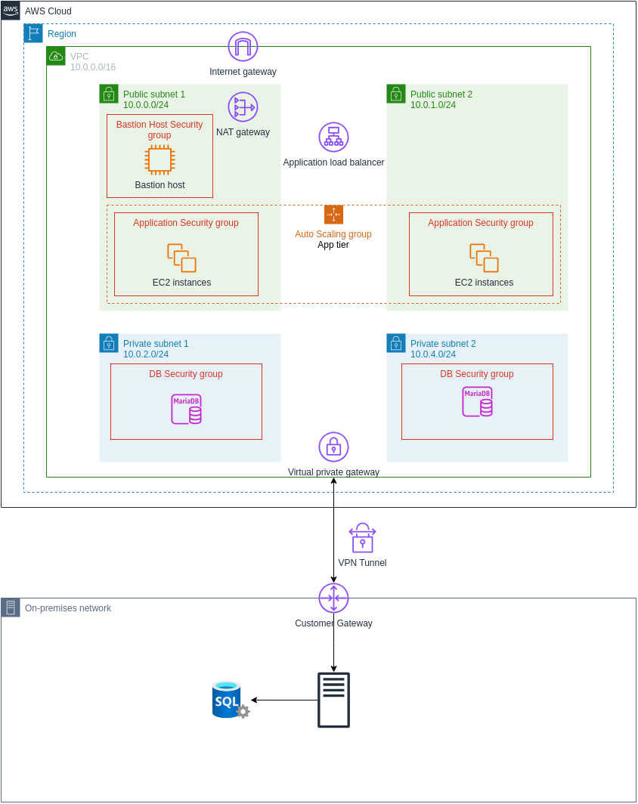

# aws-saa-capstone

Final project for my AWS Solutions Architect Associate course.

## Objective

Create a highly available, fault tolerant, scalable, and secure web application with a hybrid network architecture.

## Features

- A PHP application interacting with a MySQL database.
- High availability with an Application Load Balancer distributing traffic across multiple instances.
- Auto-scaling (in response to increased CPU load) using a launch template.
- A VPN Tunnel to facilitate data transfer between cloud and on-premises systems.
- A NAT Gateway to allow outbound internet access for the private cloud network.
- A bastion host to allow SSH access to backend systems.
- Chain of trust between the load balancer, bastion host, and backend systems.

## Design

