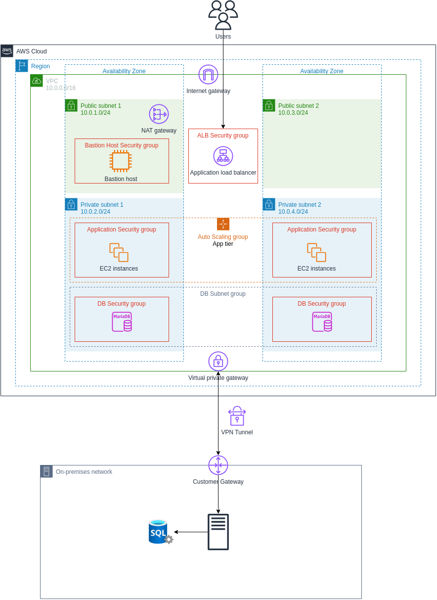

# aws-saa-capstone

Final project of my AWS Academy Cloud Architecting course

## Objective

Create a highly available, fault tolerant, scalable, and secure web application with a hybrid network architecture.

## Features

- A PHP application interacting with a MySQL database.
- A Bastion host to allow SSH access to the web servers.
- A Load Balancer to distribute traffic across multiple web servers.
- Auto-scaling in response to CPU load.
- A VPN Tunnel to facilitate data transfer between cloud and on-premises systems.
- A NAT Gateway to allow outbound internet access for the private network.
- Security Groups to restrict access to backend systems.

## Design

